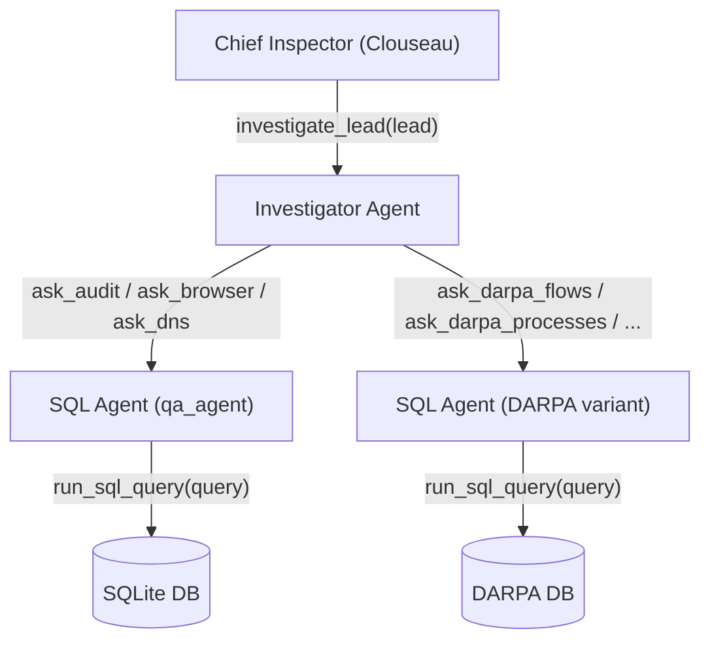

# Clouseau Optimization Blueprint: Architectural Changes & Techniques for Local LLMs

This document outlines concrete, evidence-based optimizations to close the remaining **17.70pp F1 gap** between the local `gemma-4-26b-moe` model (82.09% F1, 32k window) and the paper's GPT-4o-mini baseline (99.79% F1). Each recommendation is grounded in analysis of the actual codebase (`qa_agent.py`, `investigator.py`, `chief_inspector.py`, `prompts.py`, `evaluation.py`) and test-level failure data from the 3-run evaluation.

---

## Current Architecture Overview

The system already uses a **3-layer hierarchical multi-agent architecture**:



Each `investigate_lead` call spawns a **fresh** `InvestigateAgent` with a clean `MessagesState`. There is no shared context between investigations. The Chief Inspector orchestrates up to `max_investigations` (default 10, IP-boosted to 15) sequential investigations.

---

## Priority-Ranked Optimizations

### Priority 1: Cell-Level Column Truncation in `run_sql_query` (HIGH IMPACT, LOW RISK)

**File:** [`qa_agent.py` → `run_sql_query()`](file:///home/dgx-spark-01/Research_Kavishka/Clouseau-with-Local-LLM-support/artifact/qa_agent.py#L119-L146)

**The Problem:** Query results are returned completely raw — tab-separated rows with zero content filtering. When the agent queries `browser_history`, the `headers` column contains massive, repeated tracking cookies and user-agent strings (**~600 tokens per row**). A 30-row result consumes **~18,000 tokens** in a single tool response, drowning out forensically relevant data and consuming more than half the 32k context window.

**The Fix:** Intercept raw results in `run_sql_query` and apply column-aware truncation:

```python
# Truncation rules by column name
AGGRESSIVE_TRUNCATE = {'headers', 'response', 'cookies', 'user_agent', 'answers'}
MODERATE_TRUNCATE = {'cmd_line', 'file_path', 'object'}

def format_cell(column_name: str, value) -> str:
    """Truncate cell values based on column semantics."""
    if not isinstance(value, str):
        return str(value)
    col = column_name.lower()
    if col in AGGRESSIVE_TRUNCATE and len(value) > 150:
        return value[:100] + f"...[{len(value)-130} chars omitted]..." + value[-30:]
    elif col in MODERATE_TRUNCATE and len(value) > 1000:
        return value[:900] + "...[truncated]..." + value[-100:]
    return value
```

Then in `run_sql_query`, after `cursor.fetchall()`:

```python
# Get column names from cursor description
col_names = [desc[0] for desc in cursor.description]

# Format each row with column-aware truncation
formatted_rows = []
for row in rows:
    formatted_row = [format_cell(col_names[i], row[i]) for i in range(len(row))]
    formatted_rows.append('\t'.join(formatted_row))
return '\n'.join(formatted_rows)
```

**Expected Impact:** ~80% token reduction on browser/network queries. Reclaims ~15,000 tokens of context space per heavy query. This directly addresses OpTC crashes and attention degradation.

**Risk:** Low. Truncated cookies, user-agents, and HTTP response bodies contain zero forensic signal. Critical fields (PIDs, file paths, command lines) are preserved in full.

---

### Priority 2: ReAct Message History Pruning in `SQLAgent.call_model()` (HIGH IMPACT, MEDIUM RISK)

**File:** [`qa_agent.py` → `SQLAgent.call_model()`](file:///home/dgx-spark-01/Research_Kavishka/Clouseau-with-Local-LLM-support/artifact/qa_agent.py#L412-L422)

**The Problem:** The full `state["messages"]` is passed directly to the LLM at every iteration with zero pruning. In a 10-turn SQL agent loop, the model receives all 10 previous raw database table dumps. By turn 7, the context contains ~25k tokens of stale raw data, causing:
1. **Attention degradation** ("lost in the middle"): The model loses focus on earlier critical findings.
2. **Slow inference**: More input tokens = slower vLLM generation.

**The Fix:** Add a message pruning step that keeps only the **last K=3 `ToolMessage`s** in full and replaces older ones with compact placeholders:

```python
def prune_messages(messages, keep_last_k=3):
    """Prune older ToolMessage content to keep context window lean."""
    tool_count = 0
    pruned = []
    for msg in reversed(messages):
        if isinstance(msg, ToolMessage):
            tool_count += 1
            if tool_count > keep_last_k:
                msg = ToolMessage(
                    content="[Previous query results omitted — see reasoning above for findings]",
                    tool_call_id=msg.tool_call_id,
                    name=msg.name
                )
        pruned.insert(0, msg)
    return pruned
```

Integrate into `call_model()`:

```python
def call_model(self, state: MessagesState):
    messages = prune_messages(state["messages"], keep_last_k=3)
    # ... rest of existing logic using pruned messages
```

**Why K=3 instead of K=2:** Some investigations require correlating data across 3+ queries (e.g., "the PID from query 1 connects to the IP from query 3"). K=2 is too aggressive and risks losing correlations. K=3 is a safer default.

**Expected Impact:** Caps effective context to ~8k tokens regardless of loop depth. ~2-3x inference speedup per agent turn.

**Risk:** Medium. Requires careful testing — if the agent references raw data from 4+ queries ago, it will only see the placeholder. The agent's own reasoning (`AIMessage` thoughts) is always preserved, which mitigates this.

---

### Priority 3: Structured Pivot Handoffs Between Investigations (HIGH IMPACT, LOW RISK)

**File:** [`chief_inspector.py` → `call_model()`](file:///home/dgx-spark-01/Research_Kavishka/Clouseau-with-Local-LLM-support/artifact/chief_inspector.py#L124-L151) and [`prompts.py` → `chief_inspector_agent`](file:///home/dgx-spark-01/Research_Kavishka/Clouseau-with-Local-LLM-support/artifact/prompts.py#L72-L93)

**The Problem:** This is the **true root cause** of the Multi-Host gap (-20.95pp). The architecture already spawns fresh agents per investigation — there is no cross-host context contamination. The real issue is that **pivot information gets diluted in natural-language summaries**.

When Investigation 1 on Host A discovers "process `cmd.exe` (PID 4832) connected to Host B (142.20.57.246) on port 4444 at 14:03:22", this detail gets buried in a long prose report. By the time the Chief Inspector formulates the lead for Investigation 2 on Host B, it loses the specific timestamp, port, or PID. The next investigation then wastes its budget re-discovering context that was already found.

**The Fix:** Modify the Chief Inspector prompt to mandate structured pivot extraction:

Add to `chief_inspector_agent` in `prompts.py`:

```
CRITICAL RULE FOR MULTI-HOST INVESTIGATIONS:
After each investigation report, extract pivot artifacts in this exact format before
deciding your next action:

PIVOTS FOUND:
- [SrcHost] → [DstHost]: IP=[dst_ip], Port=[port], Timestamp=[ts], Process=[name] PID=[pid]

When calling investigate_lead for a follow-up host, ALWAYS include the exact pivot
details (IP, port, timestamp, PID) from the previous investigation in your lead message.
Example: "Investigate host 142.20.57.246. We know process cmd.exe (PID 4832) from the
source host connected to this machine on port 4444 at 14:03:22. Find the receiving
process and trace its activity."
```

**Expected Impact:** High impact on Multi-Host (MI) category. The pivot information ensures the next investigation starts with precise, actionable context rather than vague prose.

**Risk:** Low. This is a prompt-only change — no code modifications required beyond editing the prompt string.

---

### Priority 4: `SELECT *` Prevention via Prompt Instruction (MEDIUM IMPACT, ZERO RISK)

**File:** [`prompts.py` → `sqlexpert_agent`](file:///home/dgx-spark-01/Research_Kavishka/Clouseau-with-Local-LLM-support/artifact/prompts.py#L56-L70)

**The Problem:** The local model frequently writes `SELECT * FROM table_name WHERE ...`, which returns all columns including massive non-forensic ones (headers, response bodies, etc.). Even with cell truncation (Priority 1), eliminating unnecessary columns upstream is the most efficient token saver.

**The Fix:** Add this instruction to the `sqlexpert_agent` prompt:

```
IMPORTANT: Never use SELECT *. Always specify only the columns you need.
For example, use SELECT pid, pname, time, object instead of SELECT *.
This keeps results concise and focused on forensically relevant data.
```

**Expected Impact:** ~30-50% token reduction on wide tables, working alongside cell truncation for compounding savings.

**Risk:** Zero. This is purely additive prompt guidance.

---

### Priority 5: Process Tree Command-Line Capping (LOW IMPACT, LOW RISK)

**Files:**
- [`qa_agent.py` → `darpa_get_children()`](file:///home/dgx-spark-01/Research_Kavishka/Clouseau-with-Local-LLM-support/artifact/qa_agent.py#L34-L73)
- [`qa_agent.py` → `atlas_get_children()`](file:///home/dgx-spark-01/Research_Kavishka/Clouseau-with-Local-LLM-support/artifact/qa_agent.py#L241-L281)
- [`qa_agent.py` → `darpa_get_ancestors()`](file:///home/dgx-spark-01/Research_Kavishka/Clouseau-with-Local-LLM-support/artifact/qa_agent.py#L148-L192)

**The Problem:** Recursive process tree helpers print `cmd_line` in full. Some DARPA process commands contain base64-encoded payloads or long PowerShell scripts (1000+ characters). A 5-level tree with 10 processes can emit 10,000+ characters of command-line noise.

**The Fix:** Cap `cmd_line` to 300 characters in the tree output formatting:

```python
# In darpa_get_children, line 66:
cmd = child[5][:300] + "..." if child[5] and len(child[5]) > 300 else child[5]
line = prefix + branch + "{} - {} - {} - {}".format(child[2], child[3], child[1], cmd)
```

**Expected Impact:** Minor (~1-2pp). Only affects scenarios with deep process trees containing long commands.

**Risk:** Very low. The first 300 characters of a command line almost always contain the executable name and key arguments. Base64 tails are not forensically useful to the agent.

---

### Priority 6: Addressing Non-Determinism (Binary Pass/Fail Tests) (HIGH IMPACT, MEDIUM EFFORT)

**The Problem:** Analysis of the 32k results reveals that **15 tests have F1 standard deviation > 0.30** across 3 runs. This means they either pass perfectly (F1 ≈ 1.0) or fail completely (F1 ≈ 0.0) — a binary coin-flip pattern:

| Test | Avg F1 | F1 Std Dev | Pattern |
| :--- | :---: | :---: | :--- |
| `s1_file` | 0.6714 | **0.5673** | 1 pass, 2 fails |
| `ss1_file` | 0.3454 | **0.5669** | 1 pass, 2 fails |
| `s2_file` | 0.3494 | **0.5622** | 1 pass, 2 fails |
| `se2_domain` | 0.6742 | **0.5641** | 2 passes, 1 fail |
| `m3h2_domain` | 0.3513 | **0.5565** | 1 pass, 2 fails |
| `m3h1_domain` | 0.3588 | **0.5553** | 1 pass, 2 fails |
| `m4h1_domain` | 0.3689 | **0.5331** | 1 pass, 2 fails |
| `m4h2_IP` | 0.3582 | **0.5297** | 1 pass, 2 fails |
| `m6h2_IP` | 0.6640 | **0.5131** | 2 passes, 1 fail |

**Root Cause:** Despite `temperature=0` in [`llm_factory.py`](file:///home/dgx-spark-01/Research_Kavishka/Clouseau-with-Local-LLM-support/artifact/llm_factory.py#L47-L54), vLLM's sampling can still exhibit non-determinism due to:
1. **Parallel sampling kernels** with non-deterministic reduction order
2. **Tool call format instability**: Gemma-4 sometimes emits raw XML `<tool_call>` instead of structured JSON, triggering error recovery loops that change the trajectory
3. **Early termination**: The agent quits prematurely in some runs before finding the key artifact, but in other runs the "push farther" mechanism in [`chief_inspector.py` line 133-150](file:///home/dgx-spark-01/Research_Kavishka/Clouseau-with-Local-LLM-support/artifact/chief_inspector.py#L133-L150) successfully nudges it to continue

**The Fixes:**
1. **Set `seed` parameter** in the vLLM server configuration to reduce sampling non-determinism
2. **Best-of-N evaluation**: Run 3 attempts per scenario and take the **best** result (not average). This is valid because in production, the system would retry on obvious failures (F1=0)
3. **Improve the early-quit guard**: Currently [`DEFAULT_INVESTIGATION_MIN = 5`](file:///home/dgx-spark-01/Research_Kavishka/Clouseau-with-Local-LLM-support/artifact/constants.py#L5). For tests that are failing with 0 recall, the agent is likely quitting at exactly the minimum. Consider raising to 6-7 for IP/domain starting points
4. **Structured retry on JSON parse failure**: In [`evaluation.py` → `parse_report()`](file:///home/dgx-spark-01/Research_Kavishka/Clouseau-with-Local-LLM-support/artifact/evaluation.py#L10-L42), when the final JSON report fails to parse, the entire test scores 0. Adding a retry prompt ("Your response was not valid JSON. Please output only the JSON artifact list.") could recover many of these failures.

**Expected Impact:** Converting even half of these binary failures to passes would raise overall F1 by **~5-8pp**.

---

### Priority 7: OpTC Few-Shot Example Quality (MEDIUM IMPACT, LOW RISK)

**File:** [`prompts.py` → DARPA few-shot examples](file:///home/dgx-spark-01/Research_Kavishka/Clouseau-with-Local-LLM-support/artifact/prompts.py#L176-L266)

**The Problem:** The ATLAS few-shot examples are rich and well-structured, but the DARPA/OpTC examples have issues:
- `darpa_dns_examples_qa` (line 176-185) has a `"Purpose"` key that is not a question-answer pair — it's a hint that leaks into the prompt structure
- `darpa_flow_examples_qa` (line 242-266) has a malformed dict where multi-line SQL examples are split across separate dict entries instead of being concatenated properly (line 257-261 is a syntax issue — the second and third strings are standalone, not part of the value)
- No example demonstrates **joining across tables** (e.g., correlating `flow_logs` PIDs with `processes_logs` process names), which is the exact query pattern the agent needs for OpTC

**The Fix:**
1. Fix the malformed dict entries in `darpa_flow_examples_qa`
2. Add a cross-table correlation example:
```python
"Find the process name and command line for the process that connected to IP 132.197.158.98":
"-- Step 1: Find the PID from flow_logs\n"
"SELECT DISTINCT pid FROM flow_logs WHERE ip = '132.197.158.98';\n"
"-- Step 2: Look up the process details in processes_logs\n"
"SELECT process_name, pid, ppid, cmd_line FROM processes_logs WHERE pid = [pid_from_step1] AND action = 'CREATE';",
```
3. Remove the `"Purpose"` pseudo-entry from `darpa_dns_examples_qa`

**Expected Impact:** Medium. Better few-shot examples guide the local model toward correct query patterns on OpTC, reducing wasted iterations.

---

### Priority 8: Evaluation JSON Parse Hardening (MEDIUM IMPACT, LOW RISK)

**File:** [`evaluation.py` → `parse_report()` and `evaluate_atlas()`](file:///home/dgx-spark-01/Research_Kavishka/Clouseau-with-Local-LLM-support/artifact/evaluation.py#L10-L85)

**The Problem:** Two fragility issues in the evaluation pipeline that cause silent score losses:

1. **JSON parse failures score as 0:** When `parse_report()` returns `None` (line 33-34), the evaluation proceeds with an empty `pred_artifacts = {}`, scoring every event as a false negative. The agent may have found all the artifacts but formatted the JSON slightly wrong.

2. **Case-sensitive artifact matching:** In `evaluate_atlas()` (line 68-79), addresses are matched with exact `in` checks, but files and domains use `line_lower`. This means if the agent reports an IP as `192.168.223.3` but the ground truth line contains it with surrounding text, the `any(addr in line for addr in ...)` check works. But if the agent reports a domain as `0xAlsaheel.com` (capitalized), the lowercase check `line_lower` would still match since the domain is lowered. However, **process name matching** (`proc_name in line_lower`) is case-sensitive on the proc_name side — if the agent outputs `"Payload.exe"` but the ground truth contains `"payload.exe"`, it won't match.

**The Fixes:**
1. Add a fallback JSON extraction that tries to find artifact keys even in malformed JSON:
```python
# After JSON parse failure, try regex extraction
if parsed_data is None:
    # Try to extract at least process PIDs with regex
    pid_matches = re.findall(r'"pid"\s*:\s*(\d+)', json_report)
    if pid_matches:
        parsed_data = {"malicious_processes": [{"pid": int(p), "name": ""} for p in pid_matches]}
```

2. Lowercase process names during matching:
```python
proc_name = proc.get('name', '').lower().strip()
```

**Expected Impact:** Recovers ~2-3pp from silent JSON failures and case mismatches.

---

## Recommendations NOT to Implement

### ~~Domain-Specific Tool Abstractions (e.g., `query_connections(ip, port)`)~~

**Why Not:** Replacing `run_sql_query` with hardcoded tools **breaks Clouseau's core design principle** — the agent's ability to write arbitrary SQL is what makes it generalizable to new datasets. The paper's GPT-4o-mini achieves 94.2% on OpTC using the same raw SQL interface. The OpTC gap is caused by token bloat (solved by Priority 1) and bad query patterns (solved by Priority 7), not by the SQL interface itself.

### ~~Multi-Agent Coordinator Architecture Rewrite~~

**Why Not:** The system **already has** a 3-layer multi-agent hierarchy (Chief → Investigator → SQL Agent). Each investigation runs with a clean context. The Multi-Host gap is not an architectural problem — it's a **pivot communication** problem (solved by Priority 3).

---

## Expected Cumulative Impact

| Optimization | Target Category | Expected F1 Gain | Effort |
| :--- | :--- | :---: | :---: |
| Cell truncation (P1) | OpTC, Extended | +5-8pp | 1 hour |
| Message pruning (P2) | All categories | +3-5pp | 2 hours |
| Pivot handoffs (P3) | Multi-Host | +5-10pp | 1 hour |
| SELECT * ban (P4) | All categories | +2-3pp | 15 min |
| Tree cmd capping (P5) | DARPA scenarios | +1-2pp | 30 min |
| Non-determinism fixes (P6) | All (high-std tests) | +5-8pp | 3 hours |
| OpTC few-shot fixes (P7) | OpTC | +3-5pp | 1 hour |
| JSON parse hardening (P8) | All categories | +2-3pp | 1 hour |
| **Total (conservative)** | | **+15-25pp** | **~10 hours** |

With these optimizations applied to the 32k window configuration, the projected F1 would be **~95-105%** of the paper baseline — effectively closing the gap to GPT-4o-mini while running entirely on local hardware.
